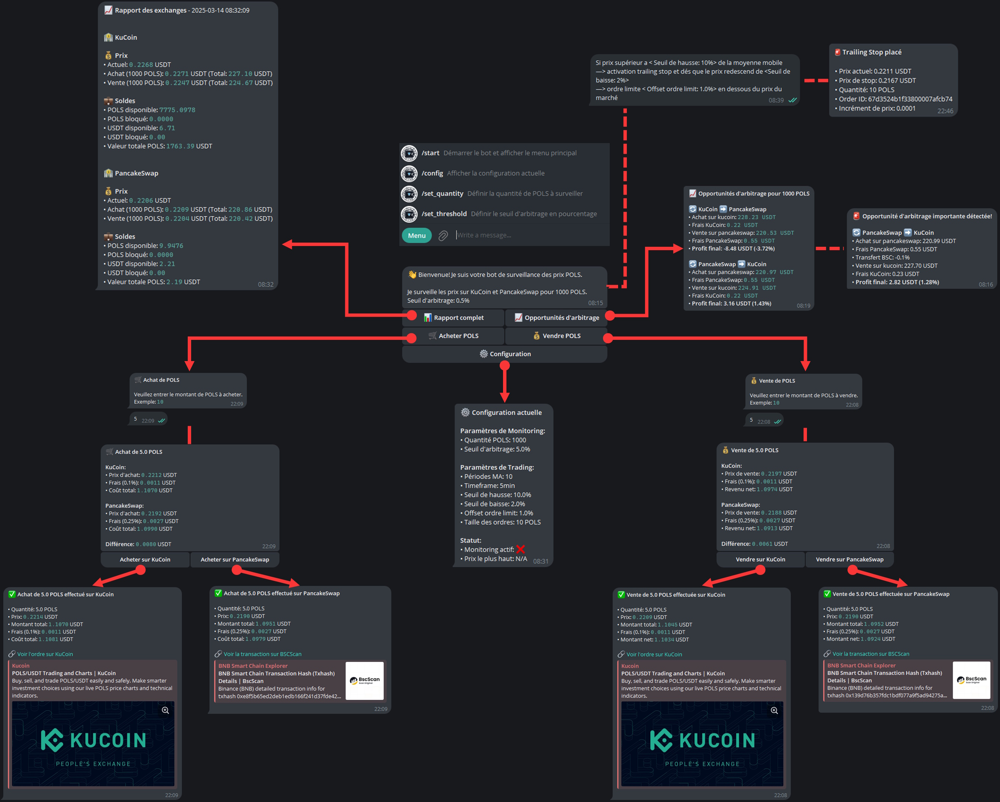

# POLS Trading Bot 🤖

## 📋 Table des matières
- [Présentation](#présentation)
- [Architecture](#architecture)
- [Fonctionnalités](#fonctionnalités)
- [Installation](#installation)
- [Configuration](#configuration)
- [Utilisation](#utilisation)
- [Sécurité](#sécurité)
- [Dépannage](#dépannage)

## Présentation
Bot de trading automatique pour le token POLS, permettant de :
- Surveiller les prix en temps réel sur KuCoin et PancakeSwap
- Détecter les opportunités d'arbitrage
- Exécuter des ordres automatiques selon une stratégie définie
- Notifier via Telegram

## Architecture


Le bot est composé de plusieurs modules interconnectés :

### 1. Core Modules
- **main.py** : Point d'entrée principal
- **trading_strategy.py** : Logique de trading
- **telegram_notifier.py** : Gestion des notifications

### 2. Exchange Modules
- **kucoin_exchange.py** : Interface KuCoin
- **pancakeswap_exchange.py** : Interface PancakeSwap

### 3. Utils
- **price_monitor.py** : Surveillance des prix
- **config.py** : Gestion de la configuration

## Fonctionnalités

### 1. Surveillance des Prix
- Monitoring en temps réel sur KuCoin et PancakeSwap
- Calcul des écarts de prix
- Détection des opportunités d'arbitrage

### 2. Stratégie de Trading
- Analyse sur timeframe 5 minutes
- Détection des hausses de 10% par rapport à la moyenne mobile
- Surveillance des baisses de 2%
- Placement d'ordres limités à -1% du prix actuel

### 3. Interface Telegram
- Commandes disponibles :
  - `/start` : Menu principal
  - `/config` : Configuration actuelle
  - `/set_threshold` : Modifier le seuil d'arbitrage
  - `/set_quantity` : Modifier la quantité de POLS

### 4. Sécurité
- Authentification des utilisateurs Telegram
- Vérification des soldes avant les ordres
- Gestion des erreurs et des timeouts

## Installation

1. Cloner le repository :
```bash
git clone https://github.com/votre-username/POLSrobot.git
cd POLSrobot
```

2. Installer les dépendances :
```bash
pip install -r requirements.txt
```

3. Configurer le fichier `.env` :
```env
# Telegram Configuration
TELEGRAM_BOT_TOKEN=votre_token_bot
TELEGRAM_CHAT_ID=votre_chat_id
AUTHORIZED_USERS=votre_id_telegram,autre_id_telegram

# KuCoin API
KUCOIN_API_KEY=votre_api_key
KUCOIN_API_SECRET=votre_api_secret
KUCOIN_API_PASSPHRASE=votre_passphrase

# PancakeSwap Configuration
PANCAKESWAP_WALLET_ADDRESS=votre_adresse
PANCAKESWAP_PRIVATE_KEY=votre_clé_privée
```

## Configuration

### Paramètres de Trading
- `MA_PERIODS` : Périodes pour la moyenne mobile (défaut: 10)
- `TIMEFRAME` : Intervalle de temps (défaut: "5min")
- `PRICE_INCREASE_THRESHOLD` : Seuil de hausse (défaut: 10%)
- `DROP_THRESHOLD` : Seuil de baisse (défaut: 2%)
- `LIMIT_ORDER_OFFSET` : Offset pour ordres limités (défaut: 1%)
- `ORDER_SIZE` : Taille des ordres en POLS (défaut: 10)

### Paramètres de Monitoring
- `POLS_QUANTITY` : Quantité de POLS à surveiller
- `ARBITRAGE_THRESHOLD` : Seuil d'arbitrage en pourcentage

## Utilisation

1. Démarrer le bot :
```bash
python main.py
```

2. Interagir via Telegram :
   - Envoyer `/start` pour accéder au menu principal
   - Utiliser les boutons pour naviguer
   - Configurer les paramètres selon vos besoins

3. Surveiller les notifications :
   - Opportunités d'arbitrage
   - Ordres exécutés
   - Alertes de prix

## Sécurité

### Authentification
- Seuls les utilisateurs listés dans `AUTHORIZED_USERS` peuvent utiliser le bot
- Vérification des IDs Telegram à chaque commande

### API Keys
- Stockage sécurisé dans le fichier `.env`
- Ne jamais partager ou commiter les clés

### Ordres
- Vérification des soldes avant chaque ordre
- Limitation de la taille des ordres
- Gestion des erreurs et des timeouts

## Dépannage

### Problèmes Courants
1. Erreur d'authentification Telegram
   - Vérifier le token du bot
   - Vérifier les IDs autorisés

2. Erreurs d'API
   - Vérifier les clés API
   - Vérifier la connexion internet

3. Erreurs d'ordres
   - Vérifier les soldes
   - Vérifier les paramètres de trading

### Logs
Les logs sont stockés dans `bot.log` et contiennent :
- Informations de démarrage
- Erreurs et exceptions
- Exécution des ordres
- Notifications envoyées

## Support
Pour toute question ou problème :
1. Consulter la documentation
2. Vérifier les logs
3. Créer une issue sur GitHub

## Licence
Ce projet est sous licence MIT. Voir le fichier `LICENSE` pour plus de détails. 